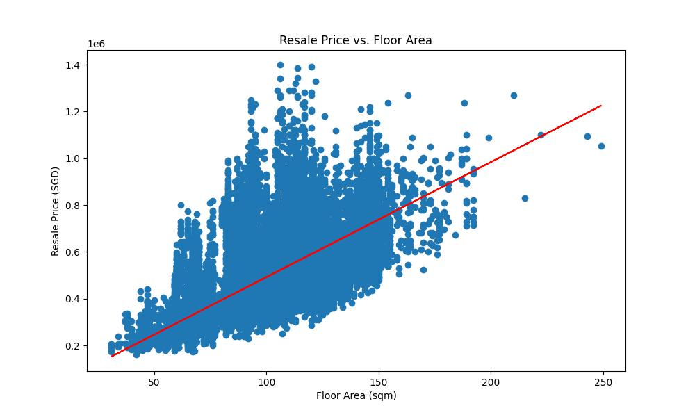
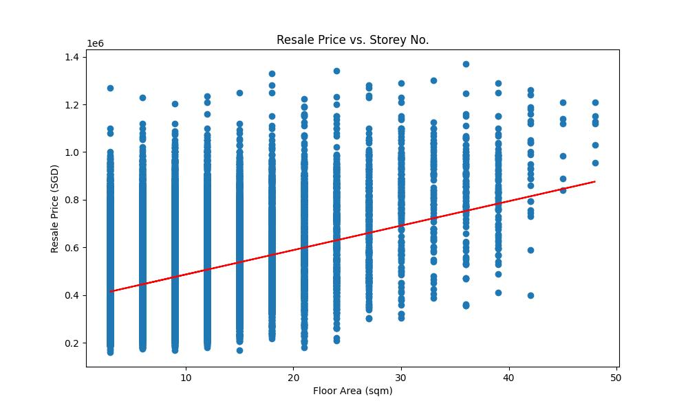

# Prediction for Flat Resale Prices for Singapore's Public Housing

Uses a linear regression model to predict the future resale prices for public housing flats in Singapore based on the following factors:
- Floor Area (sqm)
- Storey Number

The dataset is collected from [Kaggle](https://www.kaggle.com/datasets/wildboarking/singapore-public-housing-resale-flat-prices).

From what I have learnt, the model uses one of the 2 sets of formula (both are sum of squares) to calculate the output.

- For a model with 1 feature:
$$\min_{\beta_0, \beta_1} \sum_{i=1}^{n} \left( y_i - (\beta_0 + \beta_1 x_i) \right)^2$$
- For a model with multiple features:
$$\min_{\beta_0, \beta_1, \ldots, \beta_p} \sum_{i=1}^{n} \left( y_i - \left( \beta_0 + \sum_{j=1}^{p} \beta_j x_{ij} \right) \right)^2$$

Where:
- $n$ is the number of observations.
- $y_i$ represents the observed value for $i$-th observation
- $\beta_0$ is the y-intercept.
- $\beta_1,...,\beta_p$ are coefficients for the features
- $x_{ij}$ represents he $j$-th feature of the $i$-th observation 

​The model assumes a linear relationship between the variables, then draws a best-fit line on a graph to match the most accurate result using the formula $y=mX+c$

There are two notebooks, [floor_area](./floor_area.ipynb) and [storey_number](./storey_number.ipynb) that use the first formula to predict the resale prices.

On [main.py](./main.py), you can use the tool to predict the resale price of the public housing flats with both features while also being able to choose a location for the model to predict on.